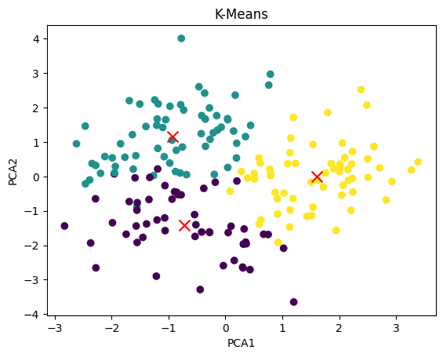
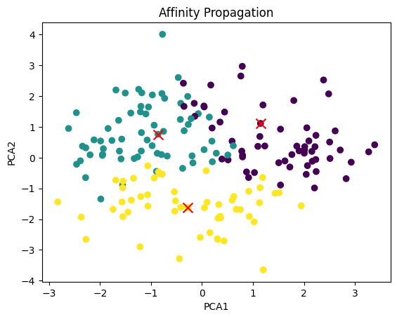

<!--- LANGUAGE --->
<h6 align="center"><a href="/README.md">PORTUGUÊS</a> | <a href="/README_en.md">ENGLISH</a>
</h6>

<!--- BANNER --->

## Machine Learning Essay
Machine Learning essay of Classification, Regularization and Clustering algorithms, with the goal of understand how diferent hyperparametrs and the spliting of data into train, validation and test datasets may impact performance and lead to overfitting or underfitting in machine learning models.

For this essay, a set of previously processed and splited data was used.

## Algorithms
The algorithms and parameters used in the study were:

## Classification
- **Algorithms:** K-Nearest Neighbors, Decision Tree, Logistic Regression and Random Forest;
- **Performance Metrics:** Accuracy, Precision, Recall and F1 Score.

### Regression 
- **Algorithms:** Decision Tree Regressor, Random Forest Regressor, Linear Regression, Linear Regression Lasso, Linear Regression Ridge, Linear Regression Elastic Net, Polynomial Regression, Polynomial Regression Lasso, Polynomial Regression Ridge and Polynomial Regression Elastic Net;
- **Performance Metrics:** R-Quadrado, MSE, RMSE, MAE and MAPE.

### Clustering
- **Algorithms:** K-Means and Affinity Propagation;
- **Performance Metrics:** Silhouette Score.

## Development
The values resulting from this trial were obtained by following these steps:

1. Train the model with training dataset using the default parameters;
2. Measure model performance on training dataset;
3. Measure model performance on validation dataset;
4. Modify chosen parameters values and train a new model using training dataset;
5. Measure performance on validation dataset;
6. Repeat steps 4 and 5 until the best value of the chosen parameters are found;
7. Merge training and validation datasets;
8. Train the final model using the merged dataset with the best parameters values;
9. Measure performance for the final model on test dataset.

> :bulb: **Clustering**  
>For clustering models techniques such as *Elbow Method* were used to choose the best parameters.

## Results
The performance results obtained for each model were:

### Classification Algorithms
___
It is possible to observe that for most classification models, the performance on validation dataset was very close to the performance on test dataset.

  <h4><b>Training Dataset</b></h4>

| **Model**               | **Accuracy** | **Precision** | **Recall** | **F1 Score** |
|-------------------------|:------------:|:-------------:|:----------:|:------------:|
| **KNN**                 | 0.782        | 0.756         | 0.733      | 0.744        |
| **Decision Tree**       | 1.0          | 1.0           | 1.0        | 1.0          |
| **Random Forest**       | 1.0          | 1.0           | 1.0        | 1.0          |
| **Logistic Regression** | 0.567        | 0.0           | 0.0        | 0.0          |

  <h4><b>Validation Dataset</b></h4>

| **Model**               | **Accuracy** | **Precision** | **Recall** | **F1 Score** |
|-------------------------|:------------:|:-------------:|:----------:|:------------:|
| **KNN**                 | 0.676        | 0.632         | 0.603      | 0.617        |
| **Decision Tree**       | 0.945        | 0.935         | 0.938      | 0.936        |
| **Random Forest**       | 0.965        | 0.974         | 0.945      | 0.959        |
| **Logistic Regression** | 0.567        | 0.0           | 0.0        | 0.0          |

  <h4><b>Test Dataset</b></h4>

| Model                   | Accuracy | Precision | Recall | F1 Score |
|-------------------------|:--------:|:---------:|:------:|:--------:|
| **KNN**                 | 0.688    | 0.648     | 0.635  | 0.642    |
| **Decision Tree**       | 0.948    | 0.940     | 0.941  | 0.940    |
| **Random Forest**       | 0.965    | 0.974     | 0.946  | 0.960    |
| **Logistic Regression** | 0.871    | 0.867     | 0.834  | 0.851    |

### Regression Algorithms
___
No regression model studied had a satisfactory performance on test data, however in some cases it is possible to see clearly the model *overfitting*.

  <h4><b>Training Dataset</b></h4>

| **Model**                              | **R-Squared** | **MSE** | **RMSE** | **MAE** | **MAPE** |
|----------------------------------------|:-------------:|:-------:|:--------:|:-------:|:--------:|
| **Decision Tree - Regressor**          | 0.992         | 3.940   | 1.985    | 0.214   | 0.083    |
| **Random Forest Regressor**            | 0.903         | 46.271  | 6.802    | 4.856   | 2.539    |
| **Linear Regression**                  | 0.046         | 455.996 | 21.354   | 16.998  | 8.653    |
| **Linear Regression - Lasso**          | 0.007         | 474.475 | 21.782   | 17.305  | 8.737    |
| **Linear Regression - Ridge**          | 0.046         | 455.996 | 21.354   | 16.998  | 8.653    |
| **Linear Regression - ElasticNet**     | 0.008         | 474.269 | 21.778   | 17.300  | 8.732    |
| **Polynomial Regression**              | 0.094         | 432.986 | 20.808   | 16.458  | 8.351    |
| **Polynomial Regression - Lasso**      | 0.009         | 473.639 | 21.763   | 17.285  | 8.700    |
| **Polynomial Regression - Ridge**      | 0.093         | 433.475 | 20.820   | 16.472  | 8.373    |
| **Polynomial Regression - ElasticNet** | 0.013         | 471.878 | 21.723   | 17.244  | 8.679    |

  <h4><b>Validation Dataset</b></h4>

| **Model**                              | **R-Squared** | **MSE** | **RMSE** | **MAE** | **MAPE** |
|----------------------------------------|:-------------:|:-------:|:--------:|:-------:|:--------:|
| **Decision Tree - Regressor**          | -0.304        | 622.636 | 24.953   | 17.167  | 6.942    |
| **Random Forest Regressor**            | 0.332         | 319.078 | 17.863   | 13.029  | 7.077    |
| **Linear Regression**                  | 0.040         | 458.447 | 21.411   | 17.040  | 8.683    |
| **Linear Regression - Lasso**          | 0.008         | 473.747 | 21.766   | 17.265  | 8.696    |
| **Linear Regression - Ridge**          | 0.040         | 458.445 | 21.411   | 17.039  | 8.682    |
| **Linear Regression - ElasticNet**     | 0.008         | 473.636 | 21.763   | 17.263  | 8.694    |
| **Polynomial Regression**              | 0.066         | 445.768 | 21.113   | 16.750  | 8.548    |
| **Polynomial Regression - Lasso**      | 0.010         | 472.913 | 21.747   | 17.238  | 8.682    |
| **Polynomial Regression - Ridge**      | 0.068         | 445.184 | 21.099   | 16.739  | 8.569    |
| **Polynomial Regression - ElasticNet** | 0.013         | 471.408 | 21.712   | 17.200  | 8.675    |

  <h4><b>Test Dataset</b></h4>

| **Model**                              | **R-Squared** | **MSE** | **RMSE** | **MAE** | **MAPE** |
|----------------------------------------|:-------------:|:-------:|:--------:|:-------:|:--------:|
| **Decision Tree - Regressor**          | 0.090         | 442.848 | 21.044   | 16.83   | 7.883    |
| **Random Forest Regressor**            | 0.404         | 290.205 | 17.035   | 12.243  | 6.288    |
| **Linear Regression**                  | 0,051         | 461.988 | 21.494   | 17.144  | 8.531    |
| **Linear Regression - Lasso**          | 0.051         | 461.988 | 21.494   | 17.144  | 8.531    |
| **Linear Regression - Ridge**          | 0.051         | 461.999 | 21.494   | 17.143  | 8.537    |
| **Linear Regression - ElasticNet**     | 0.051         | 461.988 | 21.494   | 17.144  | 8.531    |
| **Polynomial Regression**              | 0.091         | 442.641 | 21.039   | 16.736  | 8.277    |
| **Polynomial Regression - Lasso**      | 0.056         | 459.514 | 21.436   | 17.017  | 8.576    |
| **Polynomial Regression - Ridge**      | 0.090         | 443.041 | 21.049   | 16.744  | 8.312    |
| **Polynomial Regression - ElasticNet** | 0.059         | 457.963 | 21.400   | 16.871  | 8.451    |

### Clustering Algorithms
___
Despite the low performance, which may indicate the need for feature selection, the two clustering algorithms found the same number of clusters.
 

| **Model**                | **N Clusters** | **Average Silhouette Score** |
|--------------------------|:--------------:|:----------------------------:|
| **K-Means**              | 3              | 0.233                        |
| **Affinity Propagation** | 3              | 0.205                        |

For these models its posssible to verify clusters separation using [Principal Component Analysis (PCA)](https://en.wikipedia.org/wiki/Principal_component_analysis).

  
&nbsp;&nbsp;&nbsp;
  

## Conclusion
By observing the behavior of these models for different values of hyperparameters its proven that these hyperparameters, despite not causing significant improvements in models' performance, can be directly responsible for the occurrence of overfitting or underfitting. Furthermore, the strategy of separating data into training, validation and test sets is what makes it possible to observe these phenomena.

We can also conclude that non-parametric algorithms had better performance than parametric algorithms, this may have been due to their better adaptation to different data distributions.

## Author
Made with ❤️ by Elias Batista 👋🏽 Get in touch!

 
